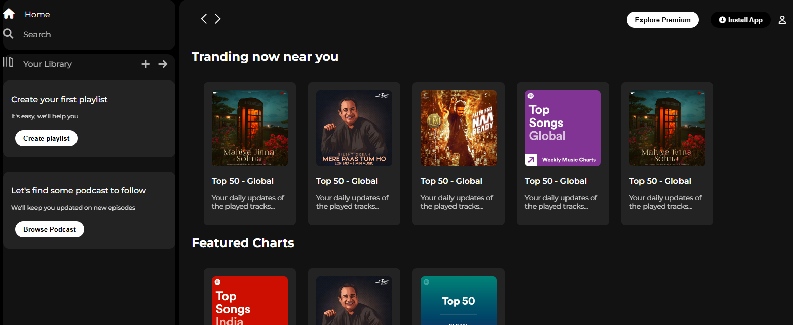

# 🎵 Spotify Home Page Clone

This is a **responsive clone** of the Spotify home page built using **HTML and CSS**. The project replicates the look and feel of the official Spotify website with a clean and modern design.

## 🚀 Live Demo
🔗 [View Live on Netlify](ebad-spotify-clone.netlify.app)  

## 📸 Preview
  

## 🛠️ Technologies Used
- **HTML5** - For structuring the content.
- **CSS3** - For styling and responsiveness.
- **Flexbox** - Used for layout design.
- **Google Fonts** - To match Spotify’s typography.
- **Font Awesome** - For icons.